## 23장 실행 컨텍스트

실행 컨텍스트는 자바스크립트의 동작원리를 담고 있는 개념

### 소스코드의 타입

ECMAScript 사양은 소스코드를 4가지 타입으로 구분한다.
<br> 4가지 타입은 실행 컨텍스트를 생성한다.

1. 전역코드 : 전역에 존재하는 소스코드
2. 함수코드 : 함수 내부에 존재하는 소스코드
3. eval 코드: 빌트인 전역함수인 eval 함수에 인수로 전달되어 실행되는 소스코드
4. 모듈 코드 : 모듈 내부에 존재하는 소스코드

### 전역코드

전역변수를 관리하기 위해 최상위 스코프인 전역스코프를 생성한다.
<br> 전역변수와 전역함수를 전역 객체의 프로퍼티와 메서드로 바인딩하고 참조하기위해 전역객체와 연결되어야한다.
<br> 해당 과정을 위해 전역코드가 평가되면 , 전역실행 컨테스트가 생성된다.

### 함수코드

지역스코프를 생성한다.
<br> 지역변수, 매개변수 , arguments 객체를 관리한다.
<br>지역스코프를 전역스코프에서 시작하는 스코프 체인의 일원으로 연결해야한다
<br> 함수코드가 평가되면 함수 실행 컨텍스트가 생성된다

### eval 코드

strict mode 에서 자신마의 독자적인 스코프를생성한다.
<br> eval 코드가 평가되면 eval 실행 컨텍스트가 생성된다.

### 모듈 코드

모듈 별로 독립적인 모듈 스코프를 생성한다.
<br> 모듈 코드가 평가되면 모듈 실행 컨텍스트가 생성된다

### 소스코드의 평가와 실행
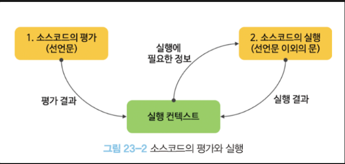
자바스크립트 엔진을 소스코드를 2개의과정 (평가, 실행) 과정으로 나누어 처리한다.
<br> 소스코드 평가 과정에서는 실행 컨텍스트를 생성하고 변수, 함수등의 선언문만 먼저 실행하여 생성된 변수나 함수 식별자를 키로 실행 컨텍스트가 관리하는 스코프에 등록한다
<br> 평가 과정이 끝나면 선언문을 제외한 소스코드가 순차적으로 실행된다(런타임 실행)
<br> 런타임 실행에 필요한 정보는 실행컨텍스트가 관리하는 스코프에서 검색해서 취득한다.

실행컨텍스트는 소스코드가 실행하는데 필요한 환경을 제공하고 코드의 실행결과를 실제로 관리하는 영역
<br> 식별자와 스코프는 실행컨텍스트의 렉시컬환경으로 관리하고 코드실행순서는 실행컨텍스트 스택으로 관리한다.


### 실행 컨텍스트의 역할

- 전역코드와 함수코드의 실행순서
1. 전역코드 평가
    1. 선언문 실행
    2. 전역 스코프에 등록
2. 전역코드 실행
    1. 런타임 시작
    2. 전역변수에 값이 할당, 함수 호출
    3. 함수 호출시 전역코드 실행 중단 일시 중단 후  해당 함수 내부로 이동
3. 함수코드 평가
    1. 매개변수와 지역변수 선언문 실행
    2. 지역 스코프에 등록
4. 함수코드 실행
    1. 런타임 시작
    2. 함수코드 종료 후 전역 코드  실행 재개

이러한 코드 실행 순서를 위해선 3가지 역할이 필요하다

1. 모든 식별자를 스코프를 구분하여 등록하고 상태변화를 지속적으로 관리
2. 스코프 체인 형성 및 스코프체인 내의 식별자 검색
3. 코드의 실행 순서 변경 및 원복가능

실행컨텍스트 는 필요한 환경을 제공하고 코드의 실행결과를 실제로 관리하는 영역

모든 코드는 실행컨텍스트를 통해 실행되고 관리된다

### 실행 컨텍스트 스택
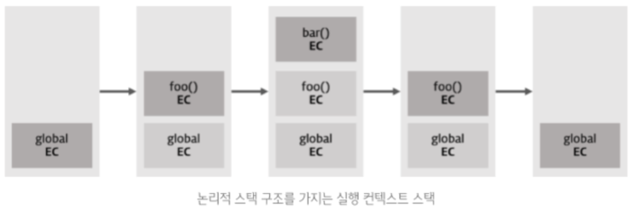
```javascript
const x = 1;

function foo(test) {
  this.test = test;
  function bar (test) {
    console.log('test')
  };

  bar():
};
foo();
```

위는 전역 코드와 함수 코드로 이루어져 있다
자바스크립트 엔진은 먼저 전역코드를 평가하여 전역 실행 컨텍스트를 생성한다. 이후 함수가 호출되면 함수코드를 평가하여 함수 실행 컨텍스트를 생성한다.
이때 생성된 실행 컨텍스트는 stack 자료구조로 관리되는데 이를 실행 컨텍스트 스택이라고 부른다.

코드 실행시 코드가 실행되는 시간에 따라 실행 컨텍스트 스택은 추가(push)되고 제거(pop)된다.

1. 전역코드의 평가와 실행

    - 전역코드를 평가하고 전역 실행 컨텍스트를 생성하고 실행컨텍스트 스택에 푸시한다.
    - 이때 전역변수 x 와 전역 함수 foo는 전역 실행 컨텍스트에 등록된다
    - 이후 전역코드가 실행되기 시작하여 전역변수 x에 값이 할당되고 전역함수 foo가 호출된다.

2. foo 함수 코드의 평가와 실행

    - 전역함수 foo가 호출되면 전역코드의 실행는 일시 중단되며 코드의 제어권이 foo 함수 내부로 이동한다.
    - foo 함수내부의 코드를 평가한다.
    - foo 함수 실행컨텍스트를 실행 컨텍스트 스택에 푸시한다

3. bar 함수 코드의 평가와 실행

    - bar 함수가 호출되면 foo 함수 코드의 실행은 일시 중단되고 코드의 제어권이 bar 함수 내부로 이동한다.
    - bar 함수내부의 코드를 평가한다.
    - bar 함수 실행컨텍스트를 실행 컨텍스트 스택에 푸시한다

4. foo 함수코드로 복귀

    - bar 함수가 종료되면 코드의 제어권은 다시 foo 함수로 이동한다.
    - 이때 bar 함수 실행 컨텍스트를 실행 컨텍스트 스택에서 팝하여 제거한다.

5. 전역 코드로 복귀
    - foo 함수가 종료되면 코드의 제어권은 다시 전역코드로 이동한다
    - 이때 foo 함수 실행 컨텍스트를 실행 컨텍스트 스택에서 팝하여 제거한다.
    - 이후 실행할 전역코드가 남아있지않으므로 전역실행컨텍스트도 실행 컨텍스트 스택에서 팝하여 실행컨텍스트 스택은 비어있게된다

이처럼 실행컨텍스트 스택의 최상위에 존재하는 실행컨텍스트는 언제나 실행중인 실행 컨텍스트이다.
<br>이를 실행중인 실행 컨텍스트 라고 부른다

### 렉시컬 환경

식별자와 식별자에 바인딩 된 값 그리고 상위 스코프에 대한 참조를 기록하는 자료구조로 실행 컨텍스트를 구성하는 컴포넌트이다.
<br> 실행컨텍스트 스택이 코드의 실행순서를 관리하면
<br> 렉시컬환경은 스코프와 식별자를 관리한다.

렉시컬환경은 키와 값을 갖는 객체 형태의 스코프를 생성하여 식별자를 키로 등록하고 식별자에 바인딩된값을 관리한다.

실행컨텍스트는 lexicalEnvirnoment 컴포넌트와 VariableEnvironmet 컴포넌트로 구성된다

생성초기에 두 컴포넌트는 하나의 동일한 렉시컬 환경을 참조하지만 이후 여러상황에따라 내용이 달라지는 경우가 존재한다.

### 렉시컬 환경의 구성
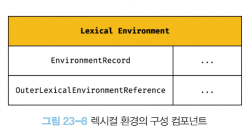
렉시컬 환경은 두개의 컴포넌트로 구성된다

1. EnvironmentRecord (환경 레코드)
    - 스코프에 포함된 식별자를 등록하고 식별자에 바인딩 된 값을 관리하는 저장소
2. OuterLexivalEnvironmentReference
    - 외부 렉시컬 환경에 대한 참조는 상위 스코프를 가리킨다
    - 상위스코프란 해당 실행 컨텍스트를 생성한 소스코드를 포함하는 상위코드의 렉시컬환경을 칭한다
    - 외부 렉시컬 환경에 대한 참조를 통해 단방향 링크드 리스트인 스코프체인을 구현한다.

### 예제를 통한 실행컨텍스트의 생성과 식별자 검색과정

```javascript
var x = 1;
const y = 2;

function foo(a) {
  var x = 3;
  const y = 4;

  function bar (b) {
    const z = 5;
    console.log(a + b + x + y + z);
  };
  bar(10):
};
foo(20); // 42
```

1. 전역객체 생성

    - 전역객체는 전역 코드가 평가되기 이전에 생성된다
    - 전역 객체에는 빌트인 전역 프로퍼티 및 전역함수 , 표준 빌트인 객체가 추가되며 동작환경에 따라 클라이언트 사이트 web Api 또는 특정환경을 위한 호스트 객체를 포함한다.
    - 이때 전역객체도 object.prototype을 상속받으며 전역객체도 프로토타입 체인의 일원이 된다.

   --- 전역객체 생성 완료 ---

2. 전역 코드 평가

    - 소스코드가 로드되면 자바스크립트 엔진은 전역코드를 평가한다.
    - 순서
        - 전역 실행 컨텍스트 생성
        - 전역 렉시컬 환경 생성
            - 전역 환경 레코드 생성
                - 객체 환경 레코드 생성
                - 선언적 환경 레코드 생성
            - this 바인딩
            - 외부 렉시컬 환경에 대한 참조 결정

    1. 전역 실행 컨텍스트 생성
    
    - 먼저 비어있는 전역 실행컨텍스트를 생성하여 실행 컨텍스트 스택에 푸시한다.

    2. 전역 렉시컬 환경 생성
    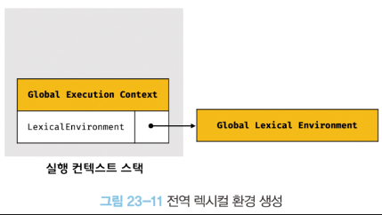
    - 전역 렉시컬 환경을 생성하고 전역 실행 컨텍스트에 바인딩 한다.
    - 렉시컬 환경은 (환경레코드 + 외부 렉시컬환경에 대한 참조) 로 이루어진다
    - 1. 전역 환경 레코드 생성
        - 전역 환경 레코드는 전역변수를 관리하는 전역 스코프, 빌트인 전역 프로퍼티 및 전역함수 , 표준 빌트인 객체를 제공한다.
        - 모든 전역변수가 전역객체의 프로퍼티가 되는 ES6 이전과 달리 let,const키워드는 전역객체의 프로퍼티가 되지않고 개념적인 블록 내에 존재한다.
        - 이때문에 전역환경 레코드도 객체환경레코드 와 선언전 환경 레코드로 구성되어 있다
            - 객체 환경 레코드는 기존의 var 키워드로 선언한 전역변수와 전역함수, 빌트인 전역 프로퍼티 및 전역함수 , 표준 빌트인 객체를관리한다
            - 선언적 환경레코드는 let, const 키워드로 선언한 전역변수를 관리한다.
        - 1. 객체 환경 레코드 생성
            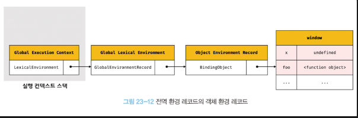
            - 객체 환경 레코드는 BindingObject라고 부르는 객체와 연결된다.
            - var 키워드로 선언한 전역변수와 함수선언문으로 정의된 전역함수는 BindingObject를 통해 전역 객체의 프로퍼티와 메서드가 된다.
            - 이것이 var 키워드로 선언된 전역변수와 함수 선언문으로 정의된 전역함수가 전역 객체의 프로퍼티와 메서드가 되고 전역 객체를 가리키는 식별자 없이 전역객체의 프로퍼티를 참조할수있는 메커니즘이다.
        ```javascript
        var x = 1;
        const y = 2;
        ```
            - x 변수는 var 키워드로 선언한 변수이므로 선언단계와 초기화 단계가 동시에 진행된다.
            - 전역 코드 평가 시점에 객체 환경 레코드에 바인딩된 BindingObject를 통해 전역 객체에 변수 식별자로 키로 등록한 다음 , 암묵적으로 undefined를 바인딩 한다.
            - 고로 var 키워드로 선언한 변수는 코드실행단계 에서 변수 선언문 이전에도 참조 할수 있다.
            - 단 변수 선언문 이전에 참조한 변수의 값은 언제나 undefined 이다.
            - 이것이 변수 호이스팅이 발생하는 원인이다.
            - 함수 호이스팅도 동일하게 발생하지만 차이점은 함수 선언문으로 정의한 함수는 생성된 함수객체를 즉시 할당하므로 선언문 이전에 호출가능하다.
        - 2. 선언적 환경 레코드 생성
            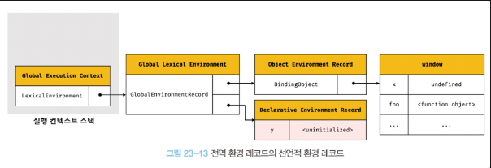
            - let, const 키워드로 선언한 전역변수는 선언적 환경 레코드에 등록되고 관리된다.
            - 해당 변수는 선언단계 와 초기화 단계가 분리되어 진행된다. 따라서 초기화 단계 즉 런타임에 실행 흐름이 변수 선언문에 도달하기전까지 일시적 사각지대(TDZ)에 빠지게된다.
            - 초기화 단계 이전에 변수에 접근하면 <uninitialized> 에러 가 발생한다.
              이는 실제로 <uninitialized>라는 값이 바인딩된것은 아니고 변수에 접근할수 없음을 나타내기 위해 사용한 표현이다.
    - 2. this 바인딩

        - 전역환경 레코드의 [[globalThisValue]] 내부 슬롯에 this가 바인딩 된다.
        - 내부슬롯에는 전역객체가 바인딩되며 전역 코드에서 this를 참조하면 내부슬롯에 바인딩되어 있는 객체가 반환된다.

    - 3. 외부 렉시컬 환경에 대한 참조 결정
        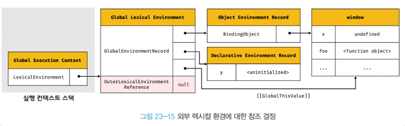
        - 외부 렉시컬 환경에 대한 참조는 현재 평가중인 소스코드를 포함하는 외부 소스코드의 렉시컬 환경 즉 상위스코프를 가리킨다.
        - 현재 평가중인 소스코드는 전역코드이므로 null이 할당된다 이는 전역 렉시컬 환경이 스코프 체인의 종점에 존재함을 의미한다.

   --- 전역 코드에 대한 평가 종료 ---

3. 전역 코드 실행
   이제 전역코드가 순차적으로 실행된다.
   전역변수 x , y 에 값이 할당되고 foo 함수가 호출된다.

    - 식별자 결정
        - 변수 할당문 또는 함수 호출문을 실행하려면 해당 식별자가 선언된 식별자인지 확인해야한다.
        - 이때 어느 스코프의 식별자를 참조할지 결정하는것을 식별자 결정이라 한다.
        - 식별자 결졍을 우리해 식별자를 검색할때는 실행중인 실행 컨텍스트에서 식별자를 검색하기시작한다.
        - 실행중인 실행 컨텍스트에서 검색할수 없으면 외부 렉시컬 환경에 대한 참조가 가리키는 렉시컬환경 즉 상위 스코프로 이동하여 식별자를 검색한다.
        - 이것이 스코프 체인의 동작원리이다.

   ```javascript
   var x = 1;
   const y = 2;

   function foo(a) {
   var x = 3;
   const y = 4;

   function bar (b) {
      const z = 5;
      console.log(a + b + x + y + z);
   };
   bar(10):
   };
   foo(20); // 42
   ```

4. foo 함수 코드 평가
    - foo 함수 호출시 foo 함수 내부로 코드 제어권이 이동하고 함수코드를 평가한다.
    - 1. 함수 실행 컨텍스트 생성
        - 먼저 foo 함수 실행 컨텍스트를 생성한다.
        - 해당 실행 컨텍스트트 실행 컨텍스트 스택에 푸시되며 실행중인 실행 컨텍스트가 된다.
    - 2. 함수 렉시컬 환경 생성
        - foo 함수 렉시컬 환경을 생성하고 foo 함수 실행 컨텍스트에 바인딩한다.
            1. 함수 환경 레코드 생성
                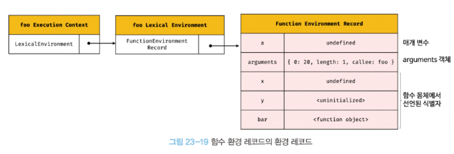
                - 함수 렉시컬 환경을 구성하는 함수 환경 레코드는 (매개변수 , argument 객체, 함수내부에서 선언한 지역변수 와 중첩 함수를 등록하고 관리한다.)
            2. this 바인딩
                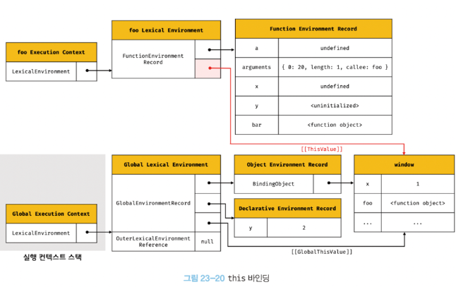
                - foo 함수는 일반함수로 호출되었으므로 this는 전역 객체가 바인딩 된다.
            3. 외부 렉시컬 환경에 대한 참조 결정
                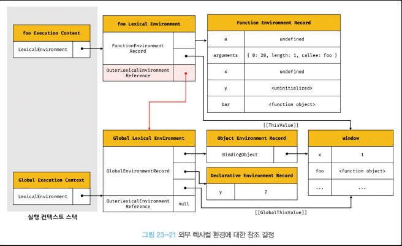
                - foo 함수 정의가 평가된 시점에 실행중인 실행 컨텍스트의 렉시컬 환경의 참조 가 할당된다.
                - foo 함수는 전역함수이므로 전역 렉시컬 환경의 참조가 할당된다.
                - 렉시컬 스코프
                    - 자바스크립트은 함수를 어디서 호출했는지가 아니라 어디에 정의했는지에 따라 상위 스코프가 결정된다.
                    - 함수 정의를 평가하여 함수 객체를 생성할때 현재 실행중인 실행 컨텍스트의 렉시컬환경, 함수의 상위 스코프를 함수객체의 내부슬롯에 저장한다.
                    - 렉시컬 환경의 외부 렉시컬 환경에 대한 참조에 할당되는것은 상위 스코프를 가리키는 함수객체의 내부슬롯에 저장된 렉시컬환경의 참조이므로 렉시컬 스코프를 구현할수 있다.
5. foo 함수 코드 실행
    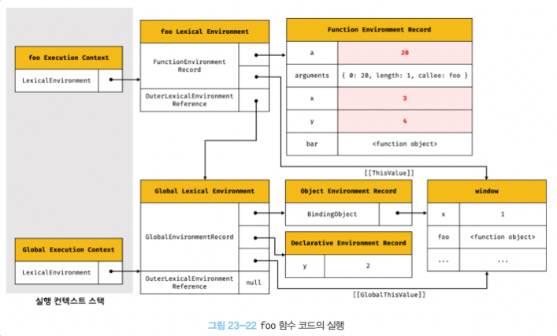
    - 이제 런타임에서 순차적으로 소스코드가 실행된다
    - 식별자 결정을 위한 실행중인 실행 컨텍스트의 렉시컬 환경에서 식별자를 검색한다
6. bar 함수 코드 평가
    - foo 함수의 평가과정과 동일
7. bar 함수 코드 실행
    - foo 함수의 실행과정과 동일
8. bar 함수 코드 실행 종료

    - 더는 실행할 코드가 없어지면 bar 함수 코드의 실행이 종료되며 bar 함수 실행 컨텍스트 가 팝되어 제거된다

    - 단 팝되어 사라지더라도 다른 누군가에 의해 참조되고 잇다면 bar 함수 렉시컬 환경은 소멸하지않는다.

9. foo 함수 코드 실행 종료
    - bar 과 동일
10. 전역 코드 실행종료

### 실행 컨텍스트 와 블록 레벨 스코프

let , const 키워드로 선언한 변수는 모든 코드 블록을 지역 스코프로 인정하는 블록 레벨 스코프를 따른다

```javascript
let x = 1;

if (true) {
  let x = 10;
  console.log(x); //10;
}
console.log(x);
```
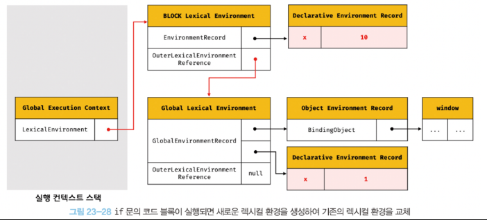
- if문 안의 코드블록 내에서 let 키워드로 변수를 선언후 코드블록을 실행하면 선언적 환경 레코드를 갖는 렉시컬 환경을 새롭게 생성하여 기존의 전역 렉시컬 환경을 교체한다.
- 이때 새롭게 생성된 렉시컬 환경의 외부 렉시컬 환경에 대한 참조는 if 문이 실행되기 이전의 렉시컬 환경을 가리킨다


#### reference

