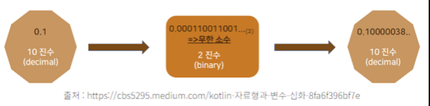

## 28장 Number
### 선언

인수를 전달하지 않고 호출하면 `[[NumberData]]` 내부 슬롯에 0을 할당한 Number 래퍼 객체를 생성.

```jsx
const numObj = new Number();
console.log(numObj); // Number {[[PrimitiveValue]]: 0}
```

### 프로퍼티

**Number.EPSILON**

1과 1보다 큰 숫자 중에서 가장 작은 숫자와의 차이

부동소수점 산술 연산 오차를 해결하기위해 사용한다.

부동소수점 오류란?

<aside>
💡 소수 중 일부는 이 과정에서 무한소수가 되어버린다. 하지만 컴퓨터 메모리에는 한계가 있어서 무한 소수를 다 담지 못하고 중간에 잘라서 유한 소수로 저장해버린다. 바로 이 과정에서 미세한 오차가 발생
</aside>


**Number.MAX_VALUE**

자바스크립트에서 표현할 수 있는 가장 큰 양수 값.

**Number.MIN_VALUE**

자바스크립트에서 표현할 수 있는 가장 작은 양수 값.

**Number.MAX_SAFE_INTEGER**

자바스크립트에서 안전하게 표현할 수 있는 가장 큰 정수값.

**Number.MIN_SAFE_INTEGER**

자바스크립트에서 안전하게 표현할 수 있는 가장 작은 정수값.

**Number.POSITIVE_INFINITY**

양의 무한대를 나타내는 숫자값 Infinity.

**Number.NEGATIVE_INFINITY**

음의 무한대를 나타내는 숫자값 -Infinity.

**Number.NaN**

숫자가 아님 (Not-a-Number)을 나타내는 숫자값.

### 메서드

공통적인 특징으론 암묵적 형변환이 없다.

**Number.isFinite**

인수로 전달된 숫자값이 Infinity 또는 -Infinity인지 여부를 검사하여 불리언 값으로 반환.

```jsx
// 인수가 정상적인 유한수이면 true를 반환한다.
Number.isFinite(0);                // -> true
Number.isFinite(Number.MAX_VALUE); // -> true
Number.isFinite(Number.MIN_VALUE); // -> true

// 인수가 무한수이면 false를 반환한다.
Number.isFinite(Infinity);  // -> false
Number.isFinite(-Infinity); // -> false
```

**Number.prototype.toFixed**

숫자를 반올림하여 문자열로 반환.

반올림하는 소수점 이하 자릿수를 나타내는 0 ~ 20 사이의 정수값을 인수로 전달 가능.

생략하면 기본값 0 이 적용.

```jsx
// 소수점 이하 반올림. 인수를 생략하면 기본값 0이 지정된다.
(12345.6789).toFixed(); // -> "12346"
// 소수점 이하 1자리수 유효, 나머지 반올림
(12345.6789).toFixed(1); // -> "12345.7"
// 소수점 이하 2자리수 유효, 나머지 반올림
(12345.6789).toFixed(2); // -> "12345.68"
// 소수점 이하 3자리수 유효, 나머지 반올림
(12345.6789).toFixed(3); // -> "12345.679"
```

**Number.prototype.toString**

숫자를 문자열로 변환하여 반환.

```jsx
// 인수를 생략하면 10진수 문자열을 반환한다.
(10).toString(); // -> "10"
// 2진수 문자열을 반환한다.
(16).toString(2); // -> "10000"
// 8진수 문자열을 반환한다.
(16).toString(8); // -> "20"
// 16진수 문자열을 반환한다.
(16).toString(16); // -> "10"
```

### 소수구분기호와 프로퍼티

```jsx
77.toExponential()
```

JS 뒤의 . 은 의미가 모호하다

일단 JS 엔진은 숫자뒤의 . 을 부동소수점의 소수구분 기호로 해석한다.

해당 모호함을 확실히하는 법은 두가지이디

1. 두번째 . 으로 사용
    - 숫자에 소수점은 하나만 존재함으로써 두번쨰는 프로퍼티로 인식

    ```jsx
    77.123.toExponential()
    ```

2. 공백 사용

    ```jsx
    77 .toExponential()
    ```

3. 그룹 연산자 사용

    ```jsx
    (77).toExponential()
    ```

#### reference

