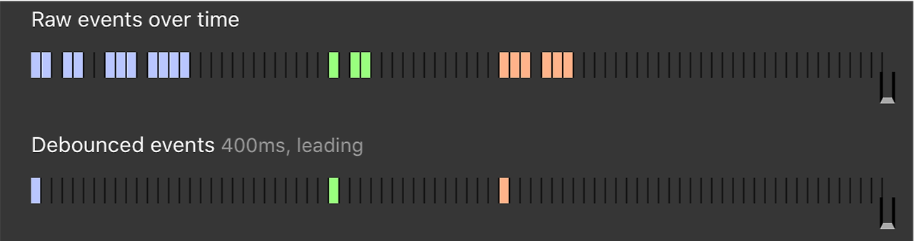
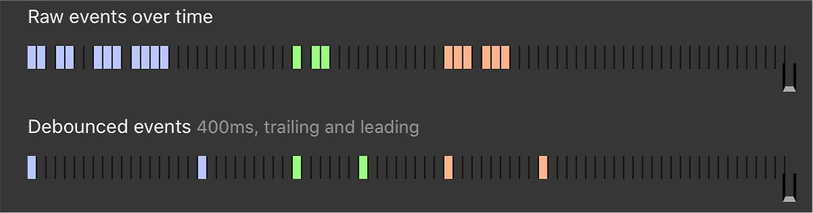

Debounce 와 throttle 에 대해서

## Debounce
- 함수를 마지막으로 호출한 후 일정 시간이 경과한 후에만 함수가 실행
- 이벤트를 그룹화하여 특정시간이 지난 후 하나의 이벤트만 발생

### Trailing Debounce

- 가장 마지막에 실행된 이벤트에 대해서만 실제 함수의 실행을 수행
- 마지막에 발생한 이벤트에 대해서 딜레이 발생

### Leading Debounce

- 맨 처음의 이벤트에 대해서만 함수를 딱 한 번만 실행하고, 나머지는 모두 무시

### Trailing AND Leading Debounce

### 사용
- 수강신청시 여러 번 클릭에도 Trailing Debounce 가 적용되어 있어 맨 마지막 이벤트만 리스닝된다.
- 서버로의 API 요청시 여러 요청에도 마지막의 결과만 리스닝 하여 Request 한다

## Throttle
- 연속해서 발생하는 이벤트에 대해서, 특정 시간을 주기로 끊어내는 개념 
- 지정된 시간 간격, Time Interval 안에 최대 한 번의 이벤트만 리스닝
- 이벤트를 일정한 주기마다 발생하도록 하는 기술

### 사용
- 스크롤 이벤트 발생시 일정 간격으로 스크롤 적용
- 지도 이동,확대,축소시 좌표값을 가져올때 너무 자주 호출되지않고 원하는 간격에만 호출
## 참조
- https://webclub.tistory.com/607
- https://nx006.tistory.com/63
- https://llu.is/throttle-and-debounce-visualized/