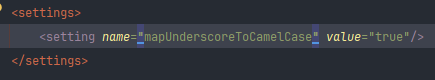

MyBatis 를 통한 sql result 파싱시 언더스코어(_)가 사라지는 이유

### MyBatis 
MyBatis 를 통하여 sql 결과 vo 파싱시 퀴리에는 언더스코어(_)로 결과를 요청하였지만 vo에 파싱시 자동으로 CamelCase로 변환된다

검색해보니<br>
MyBatis 는 SQL 결과 집합의 컬럼 이름을 CamelCase 형식의 Java 속성 이름으로 자동으로 매핑합니다.<br> 
라고 나온다

### mybatis.mapUnderscoreToCamelCase


해당 동작은 MyBatis의 mapUnderscoreToCamelCase 설정 옵션에 의해 제어되며 해당 옵션이 활성화 되있는 경우<br> 
자동으로 언더스코어(_) -> CamelCase 형식으로 변환한다.

### 언더스코어(_) 유지하고 싶을시
언더스코어(_) 유지하여 사용하고 싶다면
1. MyBatis 설정 변경

```text
<settings>
  <setting name="mapUnderscoreToCamelCase" value="false"/>
</settings>
```
- mapUnderscoreToCamelCase를 비활성화하여 SQL 결과 집합의 컬럼 이름을 Java 속성 이름과 동일하게 매핑

2. Alias 사용

```text
SELECT user_id AS userId, user_name AS userName FROM users;
```
- SQL 쿼리에서 컬럼 이름에 별칭을 사용하여 Java 속성 이름과 일치

둘 중 편한 방법을 사용하면 된다.