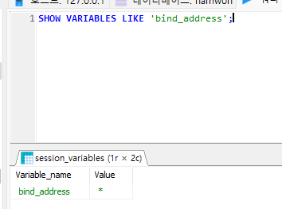

회사에서 연계 db로 mysql를 받앗는데 개발서버와 로컬 pc로 연결이 안됨

## MySQL에서 모든 IP에서의 접속을 허용
1. my.cnf 파일 생성
```text
   [mysqld]
   bind-address = 192.168.1.100
```
2. 설치된 mySql 서비스 위치에 my.cnf 위치시킨다

3. mySql 서비스 재구동
4. bind_address 확인
```mysql
    SHOW VARIABLES LIKE 'bind_address';
```

- bind-address 가 *로 설정되어 있다면, MySQL 서버는 모든 IP 주소에서의 연결을 허용

## host 연결 오류 , MySQL의 권한 설정
- 오류
  - null,  message from server: "Host '사용자명' is not allowed to connect to this MySQL server"
- 해결
    ```mysql
        GRANT ALL PRIVILEGES ON *.* TO 'root'@'사용자명';
        ALTER USER 'root'@'사용자명' IDENTIFIED BY '패스워드';
    ```
    - 사용자가 호스트에 대한 연결 권한 부여

## dbeaver 사용중 Public Key Retrieval is not allowed 에러
MySQL의 8.x 버전 이후부터 발생하는 문제


- 참조
[https://computer-science-student.tistory.com/719](https://computer-science-student.tistory.com/719)